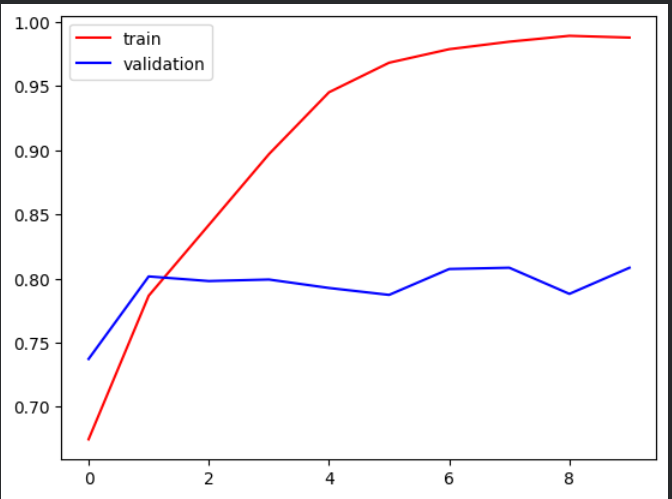
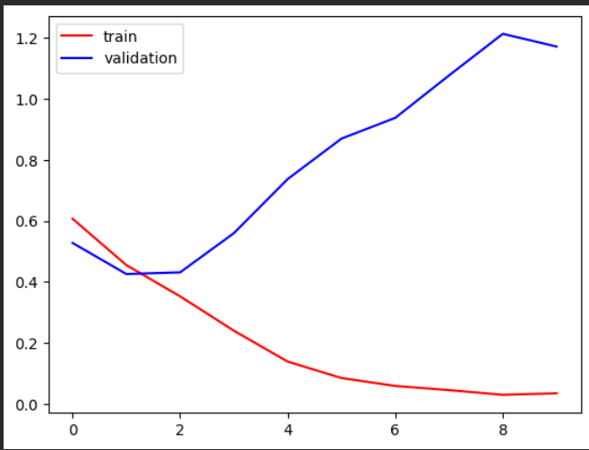

# Dogs vs Cats Image Classification using CNN

A binary image classifier built with a Convolutional Neural Network (CNN) to distinguish between dogs and cats. Trained on the Kaggle Dogs vs Cats dataset (25,000 images).

## 🚀 Project Highlights

- Built a CNN from scratch for binary image classification  
- Achieved ~99% training accuracy and ~81% validation accuracy  
- Identified and analyzed overfitting behavior  
- Implemented end-to-end training pipeline using TensorFlow/Keras
  
## Results

| Metric | Value |
|---|---|
| Training Accuracy | 98.97% |
| Validation Accuracy | 80.84% |
| Training Loss | 0.0313 |
| Validation Loss | 1.1706 |

> **Note:** The model shows signs of overfitting — training accuracy significantly exceeds validation accuracy. See the [Known Limitations](#known-limitations) section for details and suggested improvements.

## Tech Stack

- Python
- TensorFlow / Keras
- NumPy
- Matplotlib
- OpenCV (cv2)

## Dataset

[Kaggle Dogs vs Cats](https://www.kaggle.com/datasets/salader/dogs-vs-cats) — 25,000 labeled images split into 20,000 training images and 5,000 test images.
Images were preprocessed and resized to 256×256 before training.

## Model Architecture

A custom CNN with 3 convolutional blocks followed by fully connected layers:

```
Conv2D(32) → MaxPooling
Conv2D(64) → MaxPooling
Conv2D(128) → MaxPooling
Flatten
Dense(128, ReLU)
Dense(64, ReLU)
Dense(1, Sigmoid)
```

- Optimizer: Adam
- Loss: Binary Crossentropy
- Input size: 256×256×3
- Epochs: 10

## Training Curves

### Accuracy


### Loss


## How to Run

1. Clone the repository
   ```bash
   git clone https://github.com/ayush201-sys/dogs-vs-cats-classification
   cd dogs-vs-cats-classification
   ```

2. Install dependencies
   ```bash
   pip install -r requirements.txt
   ```

3. Set up Kaggle API and download the dataset
   ```bash
   # Place your kaggle.json in the project root
   kaggle datasets download -d salader/dogs-vs-cats
   unzip dogs-vs-cats.zip
   ```

4. Open and run the notebook
   ```bash
   jupyter notebook dog_vs_cat.ipynb
   ```

   Or open directly in [Google Colab](https://colab.research.google.com/).

## Known Limitations

The model shows clear overfitting after ~2 epochs, where validation loss increases while training loss continues to decrease, indicating poor generalization. — validation loss rises steadily while training loss continues to drop. Planned improvements:

- Add **Dropout layers** after dense layers to regularize
- Apply **Data Augmentation** (flips, rotations, zoom) to increase effective training set size
- Try **Transfer Learning** with MobileNetV2 or EfficientNet for significantly better validation accuracy

## Use Case

This project demonstrates:
- Binary image classification using deep learning
- CNN architecture design from scratch
- Training pipeline with Keras `image_dataset_from_directory`
- Model evaluation and overfitting analysis

## Author

Ayush Pandey  
IEEE Research Author | Machine Learning | Python  
[LinkedIn](http://www.linkedin.com/in/ayush-pandey-786r1) · [GitHub](https://github.com/ayush201-sys)
